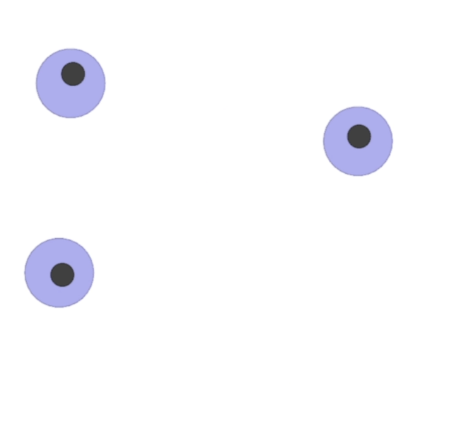

# Multi-Agent Reinforcement Learning Easy Demo
This rep simply implements two MARL algorithms, IPPO, MADDPG, in an union framework, testing on the [OpenAI Multi-Agent Particle Environment](https://github.com/openai/multiagent-particle-envs). This code is **easy to read and learn**. We hope that this rep can help you easily understand the codes in MARL and have a try by yourself.

The basic framework of this code is from my [MARL homework](https://github.com/joenghl/SYSU_2023SpringRL/tree/master/Assignment2).

## Enviroment Introduction

We use the `simple_spread` environment in [MPE](https://github.com/openai/multiagent-particle-envs). This is a **cooperative enviroment**, where all the agents collaborate to achieve the same goal together. We show the image below to show the environment.

More specifically, all agents are globally **rewarded based on** how far the closest agent is to each landmark (sum of the minimum distances). Locally, the agents are penalized if they collide with other agents (-1 for each collision). The relative weights of these rewards can be controlled with the local_ratio parameter.

**Agent observations:** `[self_vel, self_pos, landmark_rel_positions, other_agent_rel_positions, communication]`.

**Agent action space:** `[no_action, move_left, move_right, move_down, move_up]`.

## How to run

### Config 
1. Clone Multi-Agent Particle Environments (MPE).

	
	git clone https://github.com/shariqiqbal2810/multiagent-particle-envs.git
	cd multiagent-particle-envs
	pip install -e .

2. Download the dependent libraries.

	
    python -m pip install tqdm matplotlib seaborn gym==0.9.4 pyglet==1.2.4 torch==1.13.1

### Train and Test the Model

Run "run_train.py" to train the algorithms. Make sure you choose the desired algorithm in "agent_id".

Run "run_test.py" to test the algorithms. We already offer the pretrained IPPO, MADDPG agents to test, you can load them and test. You can uncomment `env.render('human')` to visualize the model testing.

## Basic Results

We test all the algorithms in 100 episodes with 25 episode length. We report the mean rewards in below. "Random" means we choose action by random, "random network" means we choose action by an randomly initialized policy network.

| Algorithm  | Results |
| ------------- | --------- |
| Random  | -9.49  |
| Random Network  | -13.36 |
| IPPO  | -8.69   |
| MADDPG  | -4.19  |

